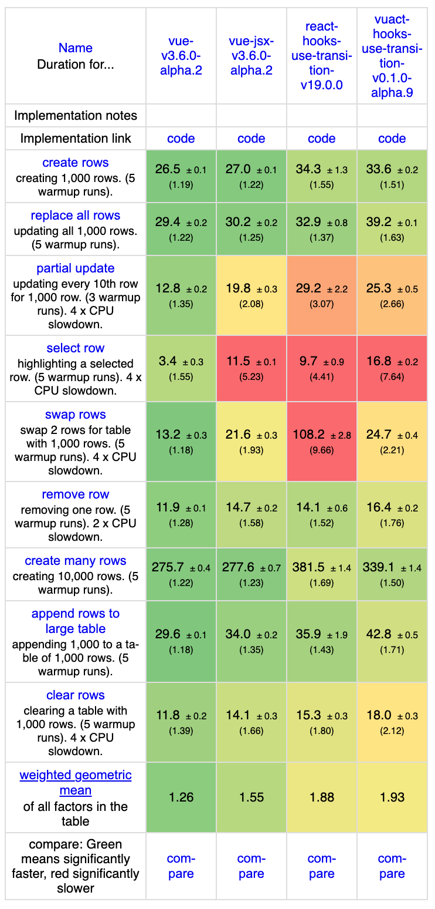

[中文](README.zh-CN.md) | English

[](https://www.npmjs.com/package/vuact)

## What is Vuact
Vuact = Vue + React. It is a compatibility layer that simulates the React runtime in a Vue 3 environment. It lets you use the React component ecosystem in Vue projects, and can also be seen as a highly React-compatible “React-like” library.

## ⚠️ Important Notice
**This project is in early development, is still unstable, and is not recommended for production use.**

## Use Cases
- Use React components in Vue apps
- Migrate from React to Vue, or from Vue to React
- Use Vue and React in the same app
- Build a stack-agnostic component library in a React-like style

## Features
- Lightweight: when using React components in Vue projects, you don’t need to install React
- Compatible with React 18 and all earlier versions (React 19 support is in progress)
- Vue and React components can call each other and nest freely
- Extends both Vue and React: Vuact is like the union of Vue and React, so you can use Vue reactivity directly inside React components
- Tested: passes most of the core React test cases

## Hello World
React component `Select.tsx`:

```tsx
export default function Select(props: {
  options: { label: string; value: string }[];
  value?: string;
  onChange?: (v: string) => void;
  prefix?: any;
  renderOption?: (o: { label: string; value: string }) => any;
}) {
  return (
    <div>
      {props.prefix}
      <select
        value={props.value}
        onChange={(e) => props.onChange?.((e.target as any).value)}
      >
        {props.options.map((o) => (
          <option key={o.value} value={o.value}>
            {props.renderOption?.(o) ?? o.label}
          </option>
        ))}
      </select>
    </div>
  );
}
```

Use the React component from Vue (`example.vue`):

```vue
<script setup lang="ts">
import { ref } from 'vue';
import { r2v } from 'vuact';
import Select from './Select';

const VSelect = r2v(Select, {
  slotsTransformConfig: { prefix: { elementProp: true }, renderOption: {} },
});
const value = ref('low');
const options = [
  { label: 'Low', value: 'low' },
  { label: 'High', value: 'high' },
];
</script>

<template>
  <VSelect :options="options" :value="value" @change="value = $event">
    <template #prefix><span>Priority</span></template>
    <template #renderOption="o">{{ o.label }} ({{ o.value }})</template>
  </VSelect>
</template>
```

## Quick Start

Recommended: use vuact skill
```bash
npx skills add yinhangfeng/vuact
```

### Install
Run the following command in a Vue 3 project:
```sh
pnpm add vuact vuact-dom
```
`vuact` and `vuact-dom` correspond to `react` and `react-dom`.

You need to upgrade Vue to 3.5 or later.

### Configuration

#### Vite
vite.config.js
```js
import { defineConfig, loadEnv } from 'vite';
import vue from '@vitejs/plugin-vue';

export default defineConfig({
  resolve: {
    // Alias react to vuact
    alias: {
      'react/jsx-runtime': 'vuact/jsx-runtime',
      'react/jsx-dev-runtime': 'vuact/jsx-dev-runtime',
      react: 'vuact',
      'react-dom/client': 'vuact-dom/client',
      'react-dom/server': 'vuact-dom/server',
      'react-dom': 'vuact-dom',
    },
  },
  optimizeDeps: {
    // With aliases set, Vite can rewrite react imports inside node_modules (e.g. react-redux) to vuact.
    // However, Vite pre-bundles dependencies into node_modules/.vite/deps by default, which can cause:
    // 1) aliased react(vuact) not updating automatically
    // 2) multiple copies of vuact being included
    // 3) cjs modules importing vuact (esm) causing errors
    exclude: ['react', 'react-dom'],
  },
});
```

##### Support both React JSX and Vue JSX in one project
vite.config.js
```js
import { defineConfig, loadEnv } from 'vite';
import vue from '@vitejs/plugin-vue';
import vueJsx from '@vitejs/plugin-vue-jsx';

export default defineConfig({
  resolve: {
    alias: {
      'react/jsx-runtime': 'vuact/jsx-runtime',
      'react/jsx-dev-runtime': 'vuact/jsx-dev-runtime',
      react: 'vuact',
      'react-dom/client': 'vuact-dom/client',
      'react-dom/server': 'vuact-dom/server',
      'react-dom': 'vuact-dom',
    },
  },
  plugins: [
    (() => {
      // Treat .react.jsx/.react.tsx files as React JSX: exclude them from vueJsx plugin
      // and let esbuild handle them directly.
      const reactJsxReg = [
        /^.+\.react\.(j|t)sx$/,
      ];
      const vueJsxPlugin = vueJsx({
        exclude: reactJsxReg,
      });
      const originConfig = vueJsxPlugin.config;
      vueJsxPlugin.config = function (config, env) {
        const result = originConfig(config, env);
        result.esbuild.include = [/\.ts$/, ...reactJsxReg];
        return result;
      };
      return vueJsxPlugin;
    })(),
  ],
  optimizeDeps: {
    exclude: ['react', 'react-dom'],
  },
});
```

tsconfig.json
```json
{
  // ...
  "compilerOptions": {
    "jsx": "react-jsx",
    "jsxImportSource": "react",
    // ...
  }
}
```
The jsx config here applies to JSX processed by esbuild, and won’t affect the vueJsx plugin.

#### pnpm overrides
This approach does not depend on any bundler. It uses pnpm overrides to replace react/react-dom with vuact/vuact-dom directly.

package.json
```json
{
  //...
  "pnpm": {
    "overrides": {
      "react": "npm:vuact@^0.1.0",
      "react-dom": "npm:vuact-dom@^0.1.0"
    }
  }
}
```

## Examples
https://yinhangfeng.github.io/vuact

Run the following commands to start the examples locally:
```bash
git clone https://github.com/yinhangfeng/vuact.git
cd vuact
pnpm i
pnpm examples
```

## Compatibility
- Vuact currently targets React 16–18, and already implements most React 19 features
- Vuact ships ESM only, while React is CJS; you may hit CJS-imports-ESM issues, so please use a modern bundler
- Since Vuact is based on Vue, there are limitations that make it impossible to fully simulate React
  - Vue uses recursive rendering, so React concurrent rendering cannot be implemented
  - Vue mutates the DOM while rendering recursively and does not have a React-like commit phase, so the call timing of useInsertionEffect and getSnapshotBeforeUpdate differs from React
- Places where @vue/runtime-dom cannot fully align with react-dom
  - react-dom’s SyntheticEvent system differs from the standard web event system (e.g. input triggers change)
  - react-dom has special handling for certain native DOM elements, such as input/form
- React 19 RSC is not supported
- For other mismatches vs React, search this repo for `TODO vuact` and check the corresponding test cases. By importance: `TODO vuact0` `TODO vuact1` `TODO vuact2` `TODO vuact3`, where `TODO vuact0` has the biggest impact

## Advanced Configuration

### Configure scheduler
In your entry file, run setupScheduler before any other code. It uses a hack to get Vue’s internal flushJobs function, in order to simulate features like ReactDOM.flushSync.
```ts
import 'vuact/setup-scheduler';
```

### Extend Vue renderer
Used to support things like input change events.

- Replace @vue/runtime-dom with @vuact/runtime-dom to export rendererOptions
package.json
```json
{
  //...
  "pnpm": {
    "overrides": {
      "@vue/runtime-dom": "npm:@vuact/runtime-dom@3.5.28-vuact.2"
    }
  }
}
```

- In your entry file, run setupRenderer before any other code. It extends rendererOptions internally.
```ts
import 'vuact/setup-renderer';
```

## Performance
Overall performance is close to React for most interaction/rendering scenarios. Because Vuact bridges two runtimes, extreme diff/large-table cases may be slightly slower, and there is still room to reduce memory usage. See JS Framework Benchmark:

- Online results (Chrome 146): https://krausest.github.io/js-framework-benchmark/2026/chrome146.html


## References
- Some design ideas come from [Veaury](https://github.com/gloriasoft/veaury)
- The initial hooks implementation referenced [Preact](https://github.com/preactjs/preact)
- Test cases are borrowed from React

## TODO
- The @vuact/runtime-dom approach isn’t ideal. Hope Vue can officially [export rendererOptions](https://github.com/vuejs/rfcs/discussions/767)
